<p align="center">
  
</p>

# adrs

Architecture Decision Records for the **TAEM** preflight system. Every ADR in this corpus is machine-checkable — the ARCH controller reads these files to enforce constraints before any code is written.

## ADR Index

| ID | Title | Status | Constraints |
|---|---|---|---|
| [ADR-000](ADR-000.yaml) | The ADR Template Standard | ACCEPTED | 3 |
| [ADR-001](ADR-001.yaml) | Unicast-Only Agent Resolution | ACCEPTED | 4 |
| [ADR-002](ADR-002.yaml) | GitHub PR as Canonical Worker Boundary | ACCEPTED | 4 |
| [ADR-003](ADR-003.yaml) | Mission Control Preflight System | ACCEPTED | 6 |
| [ADR-004](ADR-004.yaml) | Git-First Mission Architecture | ACCEPTED | 7 |
| [ADR-005](ADR-005.yaml) | LLM Boundary — Deterministic vs Inference | ACCEPTED | 7 |
| [ADR-006](ADR-006.yaml) | Ecosystem Layer — Persistent Semantic Map | ACCEPTED | 5 |
| [ADR-007](ADR-007.yaml) | Kernel Architecture — Gate State Machine | ACCEPTED | 6 |

## Format

All ADRs follow the [ADR-000 template](ADR-000.yaml). Every HARD constraint includes a machine-parseable `check:` field that ARCH evaluates deterministically.

```yaml
constraints:
  - id: C-001-001
    type: HARD
    scope: routing
    rule: "All agent-to-agent resolution must be unicast."
    check: |
      ARCH.scan(plan, patterns=['multicast', 'broadcast', ...]) == []
    violation: NO-GO
```

## Constraint Summary

- **HARD constraints**: 32 — violation is automatic NO-GO
- **SOFT constraints**: 8 — violation is WARN (non-blocking in isolation)
- **ADVISORY**: 2 — logged but not gating

## How ARCH Uses This Corpus

1. ARCH loads all `*.yaml` files from this repo
2. Extracts `constraints[]` from each ADR
3. For HARD constraints: evaluates `check:` expression against the integration plan
4. Any HARD violation → NO-GO signal to the gate state machine
5. SOFT violations → WARN (FAO tracks, gates only if timeline at risk)

## Related Repos

| Repo | Relationship |
|---|---|
| [taem](https://github.com/TAEM-DEV/taem) | Kernel — ARCH controller reads this corpus |
| [ecosystem](https://github.com/TAEM-DEV/ecosystem) | Stores constraints in `constraint_index` collection |
| [mc-state](https://github.com/TAEM-DEV/mc-state) | Mission state — signals reference constraint IDs |

<!-- org-footer -->
---

<p align="center"><sub>Part of <a href="https://github.com/TAEM-DEV">TAEM</a> · mission control preflight for software integration · built by <a href="https://github.com/ry-ops">ry-ops</a></sub></p>
